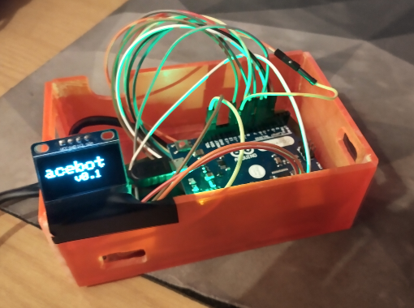

# acebot

minimalist arduino powered tasbot-like replay device for NES

supports BizHawk and FCEUX replays, handles lag frames automatically

### parts needed

* nes controller
* arduino leonardo
* 128x64 OLED screen
* wires, soldering stuff

the screen is optional but useful for debugging

other arduino boards should work with minor adjustments

### circuit 

[controller pin diagram](https://content.instructables.com/FAS/BGIL/I4SCSNBA/FASBGILI4SCSNBA.jpg)

connect each controller button to a digital pin on the arduino

connect controller ground to arduino ground

connect controller latch to an interrupt pin on the arduino

read or change the code in [acebot.ino](./acebot.ino) for pin mapping

### playback

get an `Input Log.txt` from a BizHawk `tasproj` file that you want to play, or use an `.fm2` from fceux

you may need to remove frames from the start to account for extra lag frames

install the adafruit gfx drivers in arduino IDE 

after flashing, run the serial program with `cargo run -- ./inputs.txt` to stream the movie over USB

turn on the console, watch the movie!

